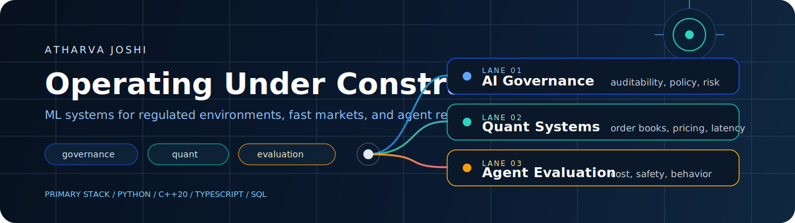
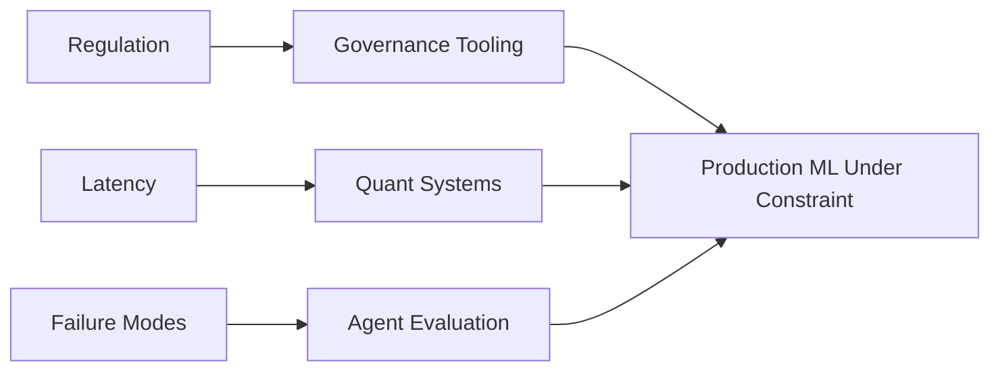

<div align="center">
  
</div>

<div align="center">

`AI governance` `quant systems` `agent evaluation` `New York`

I build ML systems for places where failure has a cost:
regulation, capital, or operational blast radius.

[LinkedIn](https://linkedin.com/in/atharvajoshi01) • [Email](mailto:atharvaj2112@gmail.com)

</div>

## Control Surface

| Channel | Signal |
| --- | --- |
| `Focus` | regulated ML, market systems, reliability tooling |
| `Primary stack` | `Python` `C++20` `TypeScript` `SQL` |
| `Bias` | systems over notebooks, proof over hype, constraints over demos |
| `Best fit` | infra, evaluation, governance, quant-adjacent engineering |

## Operating Map



## Flagship Systems

| System | What it does | Stack |
| --- | --- | --- |
| [finreg-ml](https://github.com/atharvajoshi01/finreg-ml) | Regulation-aware ML pipeline with reporting, fairness checks, drift monitoring, and audit-oriented outputs | `Python` `scikit-learn` `SHAP` `Pydantic` |
| [agenteval](https://github.com/atharvajoshi01/agenteval) | Evaluation framework for AI agents with cost, latency, and safety checks | `Python` `asyncio` `Pydantic` `tiktoken` |
| [Atlas](https://github.com/atharvajoshi01/Atlas) | Low-latency order book engine with a C++ core and Python research layer | `C++20` `Python` `XGBoost` |
| [deep-galerkin-pricing](https://github.com/atharvajoshi01/deep-galerkin-pricing) | Neural PDE solver for option pricing using the Deep Galerkin Method | `PyTorch` `quant finance` |

<details>
<summary><code>inspect /verified-open-source</code></summary>

These are actual public PRs, not loose claims.

- [microsoft/agent-governance-toolkit#776](https://github.com/microsoft/agent-governance-toolkit/pull/776) `merged`
  Promoted `EUAIActRiskClassifier` from example code into the library with tests and external config.
- [microsoft/agent-governance-toolkit#786](https://github.com/microsoft/agent-governance-toolkit/pull/786) `merged`
  Added docs, examples, changelog, and README support for the classifier.
- [AI4Finance-Foundation/FinRL#1410](https://github.com/AI4Finance-Foundation/FinRL/pull/1410) `merged`
  Fixed incorrect `threading.Thread` target invocation in paper trading.
- [google/tf-quant-finance#113](https://github.com/google/tf-quant-finance/pull/113) `open`
  Replaced `md5` with `sha256` in a cache-key hashing utility.
- [goldmansachs/gs-quant#345](https://github.com/goldmansachs/gs-quant/pull/345) `open`
  Fixed pandas 2.x compatibility by replacing removed `.append()` calls.
- [sktime/sktime#9809](https://github.com/sktime/sktime/pull/9809) `open`
  Fixed `NaiveForecaster.predict_var(cov=True)` returning all-`NaN` covariance matrices.

</details>

<details>
<summary><code>inspect /how-i-think</code></summary>

- I like systems with hard edges: compliance requirements, latency budgets, reproducibility, failure analysis.
- I prefer tools that survive contact with production instead of looking good in a screenshot.
- I am most useful where ML touches governance, finance, or operationally sensitive workflows.

</details>

<details>
<summary><code>inspect /terminal</code></summary>

```text
$ whoami
Atharva Joshi

$ domains --active
AI governance
Quantitative finance
Agent evaluation

$ optimize-for
Correctness
System constraints
Public proof of work

$ location
New York, USA
```

</details>

## Current Direction

- Building governance tooling that is harder to fake and easier to audit
- Treating agent evaluation as an engineering discipline, not a prompt contest
- Working closer to real market and infrastructure constraints

## Contact

- Email: [atharvaj2112@gmail.com](mailto:atharvaj2112@gmail.com)
- LinkedIn: [linkedin.com/in/atharvajoshi01](https://linkedin.com/in/atharvajoshi01)
