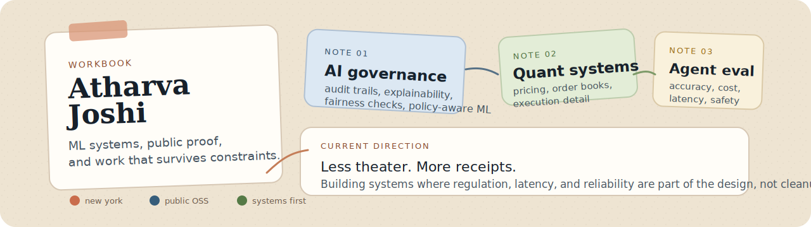

  

I work on machine learning systems that need to hold up in the real world.

That usually means some mix of regulation, latency, and reliability.

[LinkedIn](https://linkedin.com/in/atharvajoshi01) • [Email](mailto:atharvaj2112@gmail.com) • New York

## What I Work On

| Area | What pulls me in |
| --- | --- |
| `AI governance` | explainability, audit trails, fairness checks, policy-aware tooling |
| `Quant systems` | order books, pricing, execution research, market microstructure |
| `Agent evaluation` | measuring accuracy, latency, cost, and safety before something ships |

I am less interested in building one more polished demo and more interested in building systems that survive constraints.

## Selected Work

| Project | What it is |
| --- | --- |
| [finreg-ml](https://github.com/atharvajoshi01/finreg-ml) | Governance-oriented ML wrapper for explainability, fairness, audit logs, and compliance-oriented reporting |
| [agenteval](https://github.com/atharvajoshi01/agenteval) | Evaluation harness for agents with side by side comparison across accuracy, latency, cost, and safety |
| [Atlas](https://github.com/atharvajoshi01/Atlas) | Order book engine with a C++ core and a Python research layer |
| [deep-galerkin-pricing](https://github.com/atharvajoshi01/deep-galerkin-pricing) | Neural PDE solver for option pricing |

## How I Like To Build

- start from the failure modes, not the press release
- keep the workflow clear enough that another engineer can audit it
- prefer evidence over posturing
- treat performance and correctness as product features

## Open Source Work

These are actual public PRs.

- [microsoft/agent-governance-toolkit#776](https://github.com/microsoft/agent-governance-toolkit/pull/776) `merged`
  Promoted `EUAIActRiskClassifier` from example code into the library with tests and external config.
- [microsoft/agent-governance-toolkit#786](https://github.com/microsoft/agent-governance-toolkit/pull/786) `merged`
  Added docs, examples, changelog, and README support for the classifier.
- [AI4Finance-Foundation/FinRL#1410](https://github.com/AI4Finance-Foundation/FinRL/pull/1410) `merged`
  Fixed incorrect `threading.Thread` target invocation in paper trading.
- [google/tf-quant-finance#113](https://github.com/google/tf-quant-finance/pull/113) `open`
  Replaced `md5` with `sha256` in a cache-key hashing utility.
- [goldmansachs/gs-quant#345](https://github.com/goldmansachs/gs-quant/pull/345) `open`
  Fixed pandas 2.x compatibility by replacing removed `.append()` calls.
- [sktime/sktime#9809](https://github.com/sktime/sktime/pull/9809) `open`
  Fixed `NaiveForecaster.predict_var(cov=True)` returning all `NaN` covariance matrices.

## Right Now

- making regulated ML workflows easier to explain and review
- treating agent evaluation like engineering work instead of theater
- moving closer to systems where implementation detail matters

## Contact

- Email: [atharvaj2112@gmail.com](mailto:atharvaj2112@gmail.com)
- LinkedIn: [linkedin.com/in/atharvajoshi01](https://linkedin.com/in/atharvajoshi01)
